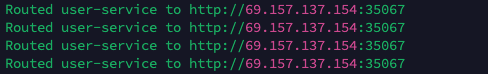
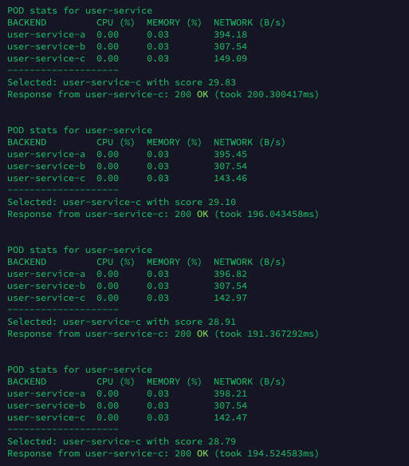

# LoadBalancer

## Client

## Server

## Server vs Client Comparison

| Feature/Aspect      | Server (Sidecar / LoadBalancer)                                 | Client                                          |
|--------------------|------------------------------------------------------------------|-------------------------------------------------|
| **Role**           | Acts as a gRPC service to intelligently route requests           | Sends gRPC requests to the server               |
| **Input**          | Receives `RouteRequest` from client                              | Triggers `RouteRequest` periodically            |
| **Output**         | Forwards HTTP call to best backend and responds via gRPC         | Prints the selected backend’s URL               |
| **Decision Logic** | Uses Prometheus metrics (CPU, Memory, Network) for selection     | No decision-making logic                        |
| **Metrics Source** | Pulls real-time metrics via Prometheus HTTP API                  | None                                            |
| **Load Balancing** | Yes — selects best of `a`, `b`, `c`                              | No — relies on server logic                     |
| **Request Count**  | Previously tracked per-backend request count                     | Previously printed backend usage every 10 sec   |
| **Output Format**  | Tabulated metrics + selection + latency info                     | Basic log of routing decisions                  |
| **Runtime**        | Persistent; awaits gRPC calls                                     | Periodically sends requests                     |
| **Communication**  | gRPC + Prometheus HTTP API + HTTP to backend                     | gRPC only                                       |
